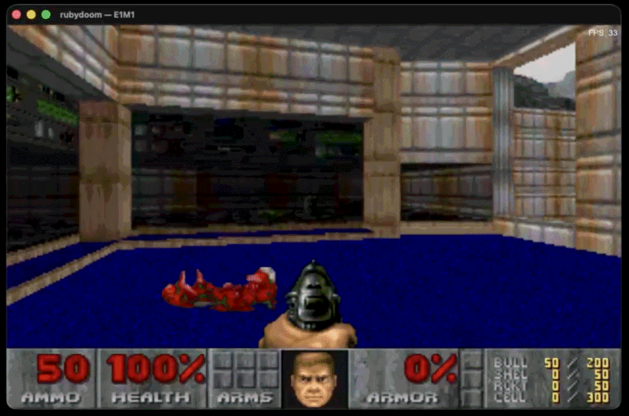

# rubydoom - pure ruby doom clone



A pure-Ruby DOOM ~~port~~ "clone". Runs headlessly (for benchmarking) or in a playable graphical form (with sound) using [Gosu](https://www.libgosu.org/).

rubydoom is designed to be a **realistic, large workload for benchmarking Ruby implementations and their JIT compilers**, but that also happens to be playable, as you prefer. The underlying engine is "pure Ruby" with Gosu as a third-party native dependency for hooking up graphics, controls, etc.

> [!IMPORTANT]
> There is an [AI disclosure](#ai-disclosure) later in this document.

## Quick start in game mode

To run it as a visual, playable experience, you need CRuby 3.4.7+  and, at minimum, a full 'IWAD' `WAD` file, like the shareware `DOOM1.WAD` or full `DOOM.WAD` which came with the original game.

> [!NOTE]
> The shareware version of DOOM1.WAD is needed but not included in this project due to licensing concerns. It is legal to download, however, and [you can get it here.](https://doomwiki.org/wiki/DOOM1.WAD)

```sh
bundle install
bin/rubydoom                            # play E1M1
bin/rubydoom --map E1M3 wads/doom.wad   # play a different map / wad
```

Default controls: WASD or arrow keys to move, mouse to look (click in the window to capture the cursor, Esc to release), left-Ctrl or left-mouse to fire, Space to use, 1–7 to switch weapons, Tab toggles the automap, P prints the current world position to stdout for debugging purposes. Arrow keys can be used to rotate left/right, if you want to avoid using the mouse entirely.

> [!TIP]
> Pressing "G" while in game enables GOD MODE if you suck like me!! 😂 As well as fixing your health at 100%, it also gives you all the weapons for a fun test. Note that the plasma rifle and BFG are NOT in the 'shareware' WAD, but you do get the rocket launcher at least.

## Benchmarking

Since the underlying engine of the game is in pure Ruby, it can be run on other implementations like TruffleRuby.

The simulation can be driven deterministically: seed the RNG, record a demo, then replay it under different configurations. Output is identical given the same seed.

```sh
# Record (interactive play, normal 35 Hz)
RUBYDOOM_RECORD=demo.rdm RUBYDOOM_SEED=42 bin/rubydoom

# Benchmark headless (no window, no GL, no vsync)
bundle exec ruby scripts/benchmark_demo.rb demo.rdm

# Compare JIT modes
bundle exec ruby scripts/benchmark_demo.rb demo.rdm
RUBYDOOM_DISABLE_YJIT=1 bundle exec ruby scripts/benchmark_demo.rb demo.rdm
```

Sample output:

```
[benchmark] jit=yjit ruby=4.0.2 tics=200 wall=0.937s tps=213.5 (4.68 ms/tic)
[benchmark] gc minor=16 major=0 alloc=629091 (671470/sec)
[benchmark] final_frame_sha1=5413388c5fe2660e8099c30b3854af64776558fc map=E1M1 seed=42
```

`tps` is simulation-plus-rasterizer throughput in pure Ruby (essentially the equivalent of fps, but without being rendered to screen). The `final_frame_sha1` is a regression check — if it changes between runs of the same demo, something nondeterministic crept in; if it changes between JIT modes, the JIT is wrong about something.

## CLI

`bin/rubydoom [options] [wad_path]`

| Flag | Default | Description |
| --- | --- | --- |
| `-m MAP` / `--map MAP` | `E1M1` | Map to load (e.g. `E1M2`, `E1M5`). |
| `-h` / `--help` | — | Show usage and exit. |
| `wad_path` (positional) | `./wads/doom1.wad` (then `./doom1.wad`) | Path to a DOOM WAD. |

## Environment variables

### Selection and difficulty

| Variable | Description |
| --- | --- |
| `RUBYDOOM_SKILL` | Skill level 0–4 (0 = ITYTD, 2 = HMP, 4 = Nightmare). Default: 2. Ignored during demo playback (skill comes from the demo header). |
| `RUBYDOOM_X`, `RUBYDOOM_Y`, `RUBYDOOM_ANGLE` | Debug spawn position. Overrides the map's `player_start` for the initial map only. |

### Demos, determinism, and benchmarking

| Variable | Description |
| --- | --- |
| `RUBYDOOM_SEED` | Seed the master RNG. Without it, every run picks a fresh seed. Threaded through every sim subsystem (combat pain rolls, monster AI, weapon spread, hitscan jitter, sector light flashes, HUD face wandering). |
| `RUBYDOOM_RECORD` | Path to write a demo file. Captures per-tic `Input` to disk while you play. Header includes the resolved seed, skill, and map so the demo is self-describing. |
| `RUBYDOOM_PLAY` | Path to a demo to replay. Skill / seed / starting map come from the file header; passing other selection env vars or `--map` is ignored. Sound is muted during playback. |
| `RUBYDOOM_BENCHMARK` | Dispatch to the headless runner instead of opening a window. Requires `RUBYDOOM_PLAY`. Prints `tics`, `wall`, `tps`, `ms/tic`, GC stats, and final-frame SHA-1. |
| `RUBYDOOM_DISABLE_YJIT` | When set, the `scripts/benchmark_demo.rb` wrapper does *not* call `RubyVM::YJIT.enable`. Useful for A/B comparisons. |

### Visual checkpoints (offscreen rendering)

| Variable | Description |
| --- | --- |
| `RUBYDOOM_DUMP_FRAME` | Path. Renders one frame to PNG and exits. Used by tests / visual diff workflows. |
| `RUBYDOOM_DUMP_TITLE` | Force the dump path to render `TITLEPIC` instead of the playfield. |
| `RUBYDOOM_WIPE_TICS` | Render the playfield with the title screen mid-melt at tic `N`. Verifies the column-melt wipe composites correctly. |
| `RUBYDOOM_AUTOMAP` | Set to `1` to start with the automap visible (Tab toggles in normal play). |
| `RUBYDOOM_AUTOMAP_MODE` | `lines` (default) or `bsp` — switches between vanilla-style line colours and a BSP-traversal visualisation. |

### Profiling

| Variable | Description |
| --- | --- |
| `RUBYDOOM_PROFILE_SECONDS` | Used by `scripts/profile_game.rb` — how long to run under stackprof before auto-closing. Default 8. |

## Scripts

  * `scripts/benchmark_demo.rb path/to/demo.rdm [wad]` — headless
    benchmark. Enables YJIT (unless `RUBYDOOM_DISABLE_YJIT` is set)
    and runs the demo through `Rubydoom::HeadlessRunner`.

  * `scripts/profile_game.rb [seconds]` — wraps `bin/rubydoom` in
    `StackProf.run` for the given duration, then exits. Output goes
    to `tmp/rubydoom-stackprof.dump`. Inspect with:

    ```sh
    bundle exec stackprof tmp/rubydoom-stackprof.dump --text --limit 40
    ```

  * `rake test` — full test suite (175 tests, no Gosu window
    required).

  * `rake profile:game` — alternate stackprof harness invoked via
    Rake. Honours `MAP`, `WAD`, `OUT`, `INTERVAL` env vars.

## How it works

The code is split into two layers separated by a small input struct:

  * **Simulation** (`lib/rubydoom/` everything not in the Gosu list
    below) — pure Ruby. Parses the WAD, builds the BSP, runs collision,
    AI, projectiles, weapons, sector physics. Takes a `Rubydoom::Input`
    each tic, advances the world, exposes state for the renderer.

  * **Frontend** — `app.rb`, `renderer3d.rb`, `automap.rb`,
    `framebuffer.rb`, `gosu_image_cache.rb`, `hud.rb`, `sound.rb`,
    `wipe.rb`. Owns the Gosu window, samples input, draws.

`Renderer3D` writes RGBA bytes into a persistent `Framebuffer` (a
plain String) via a column-major rasterizer for walls and a row-major
rasterizer for visplanes, with COLORMAP shading by row. The last step
uploads that buffer to a Gosu image — and that's the only line that
needs a GL context. Pass `present: false` to skip it.

For benchmarking, `Rubydoom::HeadlessRunner` constructs `Game` +
`Renderer3D` directly, replays a demo, calls `draw(present: false)`
each tic, and reports throughput. No `App`, no `Gosu::Window`, no
display required.

The simulation tic rate is DOOM's native 35 Hz. Every speed, timer,
and animation duration in the codebase is expressed in tics.

## Demo file format

Documented at the top of `lib/rubydoom/demo.rb`. Compact binary:

  * 4-byte magic `"RDM1"`
  * `u8` version, `u8` skill, `u64` seed (big-endian)
  * `u8` map-name length, ASCII map name
  * Per-tic record: walk / strafe / turn (`s8` each), fire (`u8`),
    look_dx (`s16`), edge count + edge codes (`u8`)

Edge codes form a stable, append-only table (`use`, `respawn`,
`toggle_god`, `weapon_1..7`, `debug_*`) — older demos keep replaying
as new edges are added.

## 🤖 AI disclosure

While I've played Doom since it first came out and have a good technical understanding of how the Doom engine works, I did not hand-write this! Claude Code did most of the work (albeit with hundreds of prompts and guidance from me) and Codex covered some of the performance side and review.

While the Doom engine was open sourced back in the 90s and is certainly in the training material for LLMs, this implementation is not a direct port from that source. Instead, I started with analyzing the WAD file, and figuring out how far we could get based solely on our collective knowledge of the game and the WAD assets. It wasn't until it came to implementing the sprites and entity behaviors (both of which rely on things hard coded into the game, rather than the WAD) that I caved in and gave Claude direct access to the source. Given that, I felt re-using the original GPL2 licence here was appropriate.

Claude and Codex did not do a perfect job on their own, however, and after profiling I noticed a lot of things that could be redone, and set them out on that, which shaved a good 50% of time off rendering a tic. So we all got there as a group effort, but was the majority of the grunt work done by AI? Yes! :-)

## Similar projects

* [khasinski/doom](https://github.com/khasinski/doom) by Chris Hasinski is a *"faithful port of the DOOM (1993) engine to pure Ruby."* It, too, uses Gosu and was also built with a benchmarking goal [which even resulted in patches to CRuby's ZJIT](https://bsky.app/profile/kris.cdaction.pl/post/3mlnna4hjis26).
* [GORE](https://github.com/AndreRenaud/Gore) and [cznic/doomgeneric](https://gitlab.com/cznic/doomgeneric/) are Go ports of Doom which use an interesting process of directly converting C code to Go.
* Three.js creator mrdoob is [working on a Three.js port of Doom](https://x.com/mrdoob/status/2054075364432031991) which uses a rather different rendering approach.

## License

This project's source is GPL v2 (see `LICENSE.TXT`), matching the
original DOOM source release. It does not include any id Software
content. The shareware `doom1.wad` is distributed by id Software
under its own terms.
